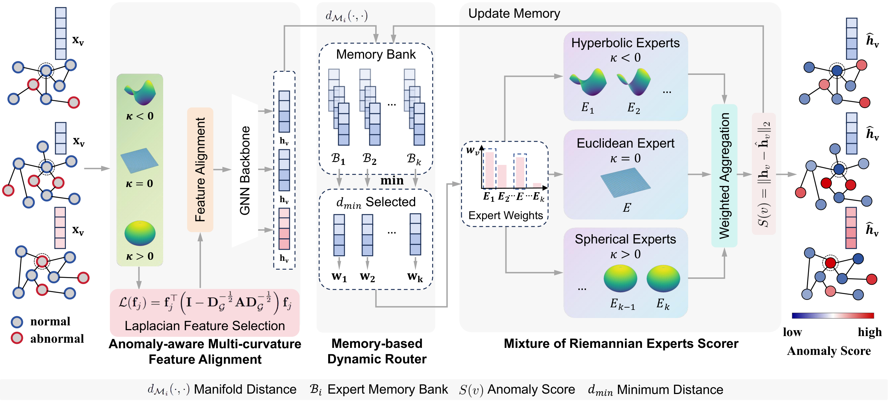

# [ICDM 2026] Zero-shot Generalizable Graph Anomaly Detection with Mixture of Riemannian Experts

Paper: [arXiv:2602.06859](https://arxiv.org/abs/2602.06859).

Authors: Xinyu Zhao, Qingyun Sun, Jiayi Luo, Xingcheng Fu, Jianxin Li.

This repository contains the implementation of **GAD-MoRE**, a zero-shot generalizable graph anomaly detection framework built around a **Mixture of Riemannian Experts (MoRE)**.



## Overview

GAD-MoRE targets zero-shot cross-graph anomaly detection, where a model is trained on source graphs and directly evaluated on unseen target graphs without target-domain training or fine-tuning.

The implementation contains three main components:

1. **Anomaly-aware Multi-curvature Feature Alignment (MCFA)**: constructs an aligned topology-aware input representation through parallel manifold mapping, dimensionality reduction, and Laplacian feature selection.
2. **Mixture of Riemannian Experts Scorer**: reconstructs node embeddings with specialized Riemannian expert networks whose curvature parameters are learnable.
3. **Memory-based Dynamic Router (MDR)**: combines adaptive exploration with reconstruction-history-based expert memories for expert selection.

## Repository Structure

```text
GAD-MoRE/
├── LICENSE
├── main.py
├── model.py
├── train_test.py
├── utils.py
├── requirements.txt
├── assets/
│   └── framework.png
├── data/
│   ├── README.md
│   └── *.mat
├── results32/
│   ├── 32_multitrain_GAD-MoRE_AUC.csv
│   └── 32_multitrain_GAD-MoRE_AP.csv
└── README.md
```

The four Python source files are the frozen implementation corresponding to the released experimental code. The reference result CSVs are preserved under `results32/`.

## Environment

A typical environment uses Python 3.9+ and the following packages:

```bash
pip install -r requirements.txt
```

For CUDA-enabled PyTorch / PyTorch Geometric, install the builds matching your CUDA environment if the default pip installation is not appropriate for your system. The code uses the first visible GPU when CUDA is available (`--device auto`). Select a GPU with `CUDA_VISIBLE_DEVICES` rather than editing the source.

## Data

The benchmark `.mat` files are included under [`data/`](data/). See [`data/README.md`](data/README.md) for the expected filenames.

Expected datasets:

**Source graphs**

```text
pubmed, Flickr, Reddit, YelpChi
```

**Unseen target graphs**

```text
ACM, Amazon, BlogCatalog, citeseer, cora, Facebook, weibo
```

Target anomaly labels are used only for evaluation.

## Training and Evaluation

From the repository root, run:

```bash
python main.py --trials 5
```

This command is the paper setting. The released code does not require a `params/` JSON file; if that directory is absent, `main.py` uses the default model configuration below.

The main experimental settings used by the release include:

```text
feature dimension: 32
number of experts: 5
top-k experts: 2
gate temperature: 0.7
training epochs: 40
learning rate: 5e-5
weight decay: 5e-5
```

Additional command-line options are available through:

```bash
python main.py --help
```

## Results

The released reference CSVs report the following averages over the seven unseen target graphs:


| Metric | Average |
| ------ | ------- |
| AUROC  | 0.8209  |
| AUPRC  | 0.3696  |


Per-dataset values and standard deviations are available in `results32/`.

New runs are written to the `results/` directory by `utils.py`.

## Reproducibility Notes

- Random seeds are set for Python, NumPy, and PyTorch for each trial (`seed = trial index`).
- The default experiment uses five trials.
- The same model configuration is used across all unseen target datasets without target-domain validation or fine-tuning.
- Benchmark `.mat` files are released under `data/`. Preprocessed feature caches created locally in `data/` are ignored by Git.

## Acknowledgements

Our implementation is built upon the official code of [ARC](https://github.com/yixinliu233/ARC) (Liu et al., NeurIPS 2024). We thank the authors for releasing their code.

```bibtex
@inproceedings{liu2024arc,
  title={ARC: A Generalist Graph Anomaly Detector with In-Context Learning},
  author={Liu, Yixin and Li, Shiyuan and Zheng, Yu and Chen, Qingfeng and Zhang, Chengqi and Pan, Shirui},
  booktitle={Advances in Neural Information Processing Systems},
  year={2024}
}
```

## License

This repository is released under the [MIT License](LICENSE).

## Citation

If you use this code, please cite our paper:

```bibtex
@article{zhao2026gadmore,
  title={Zero-shot Generalizable Graph Anomaly Detection with Mixture of Riemannian Experts},
  author={Zhao, Xinyu and Sun, Qingyun and Luo, Jiayi and Fu, Xingcheng and Li, Jianxin},
  journal={arXiv preprint arXiv:2602.06859},
  year={2026}
}
```

The IEEE proceedings BibTeX will replace the preprint entry after the ICDM 2026 publication metadata is available.
