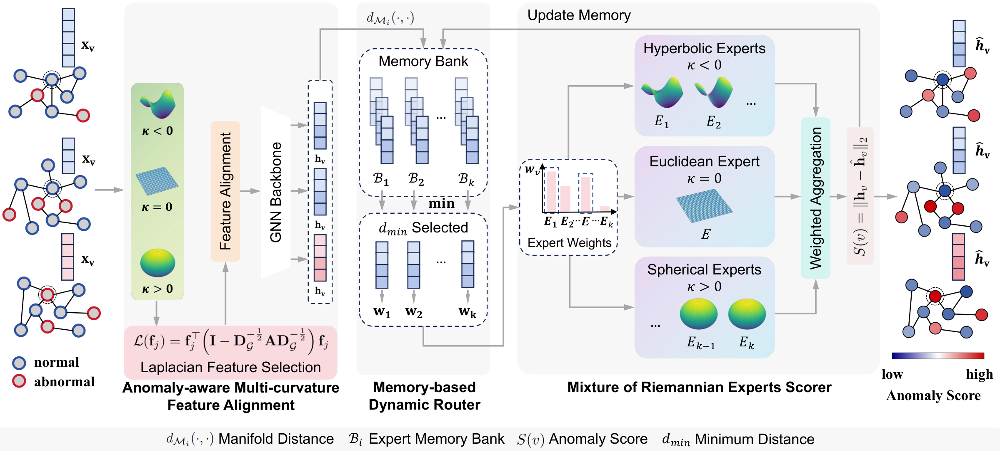

# [ICDM 2026] Zero-shot Generalizable Graph Anomaly Detection with Mixture of Riemannian Experts

Paper: [arXiv:2602.06859](https://arxiv.org/abs/2602.06859).

Authors: Xinyu Zhao, Qingyun Sun, Jiayi Luo, Xingcheng Fu, Jianxin Li.

This repository contains the implementation of **GAD-MoRE**, a zero-shot generalizable graph anomaly detection framework built around a **Mixture of Riemannian Experts (MoRE)**.



## Overview

GAD-MoRE targets zero-shot cross-graph anomaly detection, where a model is trained on source graphs and directly evaluated on unseen target graphs without target-domain training or fine-tuning.

The implementation contains three main components:

1. **Anomaly-aware Multi-curvature Feature Alignment (MCFA)**: constructs an aligned topology-aware input representation through parallel manifold mapping, dimensionality reduction, and Laplacian feature selection.
2. **Mixture of Riemannian Experts Scorer**: reconstructs node embeddings with specialized Riemannian expert networks whose curvature parameters are learnable.
3. **Memory-based Dynamic Router (MDR)**: combines adaptive exploration with reconstruction-history-based expert memories for expert selection.

## Repository Structure

```text
GAD-MoRE/
├── LICENSE
├── main.py
├── model.py
├── train_test.py
├── utils.py
├── requirements.txt
├── assets/
│   └── framework.png
├── data/
│   ├── README.md
│   └── *.mat
├── results32/
│   ├── 32_multitrain_GAD-MoRE_AUC.csv
│   └── 32_multitrain_GAD-MoRE_AP.csv
└── README.md
```

The four Python source files are the frozen implementation corresponding to the released experimental code. The reference result CSVs are preserved under `results32/`.

## Environment

Use an isolated **Linux x86_64 / Python 3.11.6** environment. The core versions recovered from the original container are:

| Component | Version |
| --- | --- |
| Python | 3.11.6 |
| PyTorch | 2.4.0+cu121 |
| PyTorch Geometric | 2.6.1 |
| Geoopt | 0.5.0 |
| NumPy | 1.26.4 |
| SciPy | 1.12.0 |
| pandas | 2.2.3 |
| scikit-learn | 1.6.1 |

Create the environment and install the complete dependency snapshot from the repository root:

```bash
conda create -n gad-more python=3.11.6 pip -y
conda activate gad-more
python -m pip install -r requirements-lock.txt
python -m pip check
python -c "import torch, torch_geometric, geoopt, numpy, scipy, pandas, sklearn; print('PyTorch:', torch.__version__, 'CUDA runtime:', torch.version.cuda, 'GPU available:', torch.cuda.is_available())"
```

Alternatively, create a virtual environment with an existing Python 3.11.6 installation and run the same pip commands. `requirements.txt` pins the core packages; `requirements-lock.txt` also pins their transitive dependencies from the isolated validation environment. Both select the CUDA 12.1 PyTorch wheel. The full lock is a clean installation snapshot, not an export of every unrelated package in the original container.

Use an NVIDIA driver compatible with the CUDA 12.1 runtime. The CUDA version displayed by `nvidia-smi` is not the PyTorch runtime version; check `torch.version.cuda` as above. Do not upgrade PyTorch to match the driver's displayed CUDA version. The code uses the first visible GPU with `--device auto`; select it with `CUDA_VISIBLE_DEVICES`.

The source uses Python 3.10+ union type annotations, so the previous generic “Python 3.9+” guidance was insufficient. Unpinned installation also selects different scientific-computing and CUDA packages over time. Pinning the environment alone does **not** establish reproduction of the historical reference scores; see the validation notes below.

## Data

The benchmark `.mat` files are included under [`data/`](data/). See [`data/README.md`](data/README.md) for the expected filenames.

Expected datasets:

**Source graphs**

```text
pubmed, Flickr, Reddit, YelpChi
```

**Unseen target graphs**

```text
ACM, Amazon, BlogCatalog, citeseer, cora, Facebook, weibo
```

Target anomaly labels are used only for evaluation.

## Training and Evaluation

From the repository root, run:

```bash
python main.py --trials 5
```

This command runs five trials with the released defaults. If `params/` is absent, `main.py` uses the default model configuration below. The release default also enables the `max_message` training loss with weight 1.0. The reference CSVs do not record that weight, and this default run did not match the reference averages in the environment audit; see [`docs/reproducibility.md`](docs/reproducibility.md) before treating this command as an exact reproduction of the reported row.

The main experimental settings used by the release include:

```text
feature dimension: 32
number of experts: 5
top-k experts: 2
gate temperature: 0.7
training epochs: 40
learning rate: 5e-5
weight decay: 5e-5
```

Additional command-line options are available through:

```bash
python main.py --help
```

## Results

The released reference CSVs report the following averages over the seven unseen target graphs:


| Metric | Average |
| ------ | ------- |
| AUROC  | 0.8209  |
| AUPRC  | 0.3696  |


Per-dataset values and standard deviations are available in `results32/`.

New runs are written to the `results/` directory by `utils.py`.

## Reproducibility Notes

- Random seeds are set for Python, NumPy, and PyTorch for each trial (`seed = trial index`).
- The default experiment uses five trials.
- The same model configuration is used across all unseen target datasets without target-domain validation or fine-tuning.
- Benchmark `.mat` files are released under `data/`. The current loader recomputes feature alignment from `.mat` files on every run; it does not read historical `*_processed_dim*.pt` caches.
- The supported and tested package versions are pinned in `requirements.txt`; `requirements-lock.txt` records the full validation environment. See [`docs/reproducibility.md`](docs/reproducibility.md) for measured results and known differences from the historical reference.

## Acknowledgements

Our implementation is built upon the official code of [ARC](https://github.com/yixinliu233/ARC) (Liu et al., NeurIPS 2024). We thank the authors for releasing their code.

```bibtex
@inproceedings{liu2024arc,
  title={ARC: A Generalist Graph Anomaly Detector with In-Context Learning},
  author={Liu, Yixin and Li, Shiyuan and Zheng, Yu and Chen, Qingfeng and Zhang, Chengqi and Pan, Shirui},
  booktitle={Advances in Neural Information Processing Systems},
  year={2024}
}
```

## License

This repository is released under the [MIT License](LICENSE).

## Citation

If you use this code, please cite our paper:

```bibtex
@article{zhao2026gadmore,
  title={Zero-shot Generalizable Graph Anomaly Detection with Mixture of Riemannian Experts},
  author={Zhao, Xinyu and Sun, Qingyun and Luo, Jiayi and Fu, Xingcheng and Li, Jianxin},
  journal={arXiv preprint arXiv:2602.06859},
  year={2026}
}
```

The IEEE proceedings BibTeX will replace the preprint entry after the ICDM 2026 publication metadata is available.

